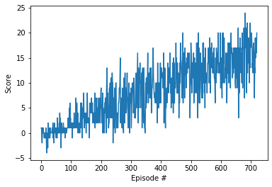

# Project 1: Navigation

## Project Details

### Action Space

0 - walk forward
1 - walk backward
2 - turn left
3 - turn right

### State Space

The state space has 37 dimensions and contains the agent's velocity, along with ray-based perception of objects around agent's forward direction. A reward of +1 is provided for collecting a yellow banana, and a reward of -1 is provided for collecting a blue banana.

### Environment Solution

The environment can be considered solved when getting an average score of at least +13 over 100 consecutive episodes.

## Getting Started

The requirements for the code are pytorch version 0.4 and open AI gym 0.4 on python 3.6.

To run the code, you run each of the cells in the `Navigation.ipynb` file in sequence, with the exception of the "take random actions" code cell.

# Report

## Learning Algorithm

The report clearly describes the learning algorithm, along with the chosen hyperparameters. It also describes the model architectures for any neural networks.

The learning algorithmed used was a double DQN that used the online network to choose actions, but the target network to evaluate those actions. No other changes were made beyond this to the basic DQN algorithm.

## Plot of Rewards

The algorithm surpasses the +13 benchmark fairly early on in its training cycle and continues to grow in average rewards past it.

A plot of rewards per episode is included to illustrate that the agent is able to receive an average reward (over 100 episodes) of at least +13. The submission reports the number of episodes needed to solve the environment.

## Ideas for Future Work

A future improvement to the work would be to add prioritized experience replay to utilize the actions with the most significant impacts on learning. Many of the steps in this algorithm don't go anywhere or contribute meaningfully to learning and be de-prioritized. Steps that  run into walls or bananas contain more information to learn from and should be prioritized.
