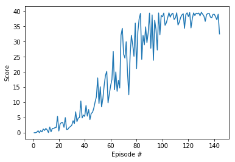

# Project 2: Continuous Control

For this project, I worked with the Reacher environment.

In this environment, a double-jointed arm can move to target locations. A reward of +0.1 is provided for each step that the agent's hand is in the goal location. Thus, the goal of your agent is to maintain its position at the target location for as many time steps as possible.

The observation space consists of 33 variables corresponding to position, rotation, velocity, and angular velocities of the arm. Each action is a vector with four numbers, corresponding to torque applicable to two joints. Every entry in the action vector should be a number between -1 and 1.

## Goal

I worked with a version that contains a single agent, and in order to solve the environment, my agent must get an average score of +30 over 100 consecutive episodes.

## Getting Started

You need to download the Reacher unity environment for Linux from here: https://s3-us-west-1.amazonaws.com/udacity-drlnd/P2/Reacher/one_agent/Reacher_Linux.zip, unzip the file and place it in this directory.

Install the required packages in the requirements.txt file using `pip install -r requirements.txt`

Run through each of the cells in the `continuous_control.ipynb` notebook.

## Learning Algorithm

I chose to go with the Deep Deterministic Policy Gradient (DDPG) algorithm which uses learns an actor and critic function to learn the optimal actions and state values in parallel. The critic (state value) model is used to critique the policy since it inherently has less bias.

### Hyper Parameters

- Buffer size: 1,000,000
- Batch size: 128
- Gamma: 0.99
- Tau: 1.003
- Actor learning rate: 0.0002
- Critic learning rate: 0.0002
- Weight decay: 0
- Update every: 1 step
- Update 1 time per step

### Neural Net Architecture

#### Actor

Dimension sizes:

- Input: 33
- Hidden layer: 128 with batch normalization
- Hidden layer: 128
- Output: 8

#### Actor

Dimension sizes:

- Input: 33
- Hidden layer: 128 with batch normalization
- Hidden layer: 128
- Output: 8

#### Critic

Dimension sizes:

- Input: 33
- Hidden layer: 128 with batch normalization
- Hidden layer: 128
- Output: 1 (Q value)

## Results: Reward Plot

The number of episodes required to reach an average score of +30 over 100 consecutive episodes was 144.

## Future Work

During training, explored options for different architectures and different hyperparameters/update cycles, but the place that people discussed the most success was in tuning how often the models were updated from the replay buffer and how many learning cycles thye did for each time.

Additionally, it would be worth looking into more recent RL algorithms such as TRPO and D4PG.

However, at the end of the traiing cycle, we were consistently getting results of about +40 for each episode which is far above the required score to solve this environment.
