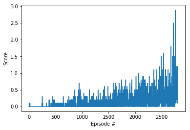

# Project 3: Collaboration and Competition

For this project, I worked with the [Unity Tennis environment](https://github.com/Unity-Technologies/ml-agents/blob/master/docs/Learning-Environment-Examples.md#tennis).

In this environment, two agents control rackets to bounce a ball over a net. If an agent hits the ball over the net, it receives a reward of +0.1. If an agent lets a ball hit the ground or hits the ball out of bounds, it receives a reward of -0.01. Thus, the goal of each agent is to keep the ball in play.

The observation space consists of 8 variables corresponding to the position and velocity of the ball and racket. Each agent receives its own, local observation. Two continuous actions are available, corresponding to movement toward (or away from) the net, and jumping.

## Goal

The task is episodic, and in order to solve the environment, your agents must get an average score of +0.5 (over 100 consecutive episodes, after taking the maximum over both agents). Specifically,

- After each episode, we add up the rewards that each agent received (without discounting), to get a score for each agent. This yields 2 (potentially different) scores. We then take the maximum of these 2 scores.
- This yields a single score for each episode.
-
The environment is considered solved, when the average (over 100 episodes) of those scores is at least +0.5.

## Getting Started

You need to download the Reacher unity environment for Linux from here: https://s3-us-west-1.amazonaws.com/udacity-drlnd/P3/Tennis/Tennis_Linux.zip, unzip the file and place it in this directory.

If you haven't already, please follow the instructions in the [DRLND GitHub repository](https://github.com/udacity/deep-reinforcement-learning#dependencies) to set up your Python environment.

Run through each of the cells in the `Tennis.ipynb` notebook.

## Learning Algorithm

I chose to go with the Deep Deterministic Policy Gradient (DDPG) algorithm which uses learns an actor and critic function to learn the optimal actions and state values in parallel. The critic (state value) model is used to critique the policy since it inherently has less bias.

I initially adapted the module 4 multi-agent lab code to work for this problem, but was unable to get any results better than random after many experiments of different architectures, learning rates and noise values.

I ended up going with the DDPG algorithm, which learned jointly the actions to be taken for both agents by combining their state spaces along with the critica which also contained full observations.

### Hyper Parameters

- Buffer size: 1,000,000
- Batch size: 1024
- Gamma: 0.99
- Tau: 0.001
- Actor learning rate: 0.001
- Critic learning rate: 0.001
- Weight decay: 0
- Update every: 5 steps
- Update 5 times per step

### Neural Net Architecture

#### Actor

Dimension sizes:

- Input: 48
- Hidden layer: 256 with batch normalization
- Hidden layer: 128
- Output: 4

#### Critic

Dimension sizes:

- Input: 48
- Hidden layer: 256 with batch normalization
- Hidden layer: 128
- Output: 1 (Q value)

## Results: Reward Plot

The number of episodes required to reach an average score of +0.5 over 100 consecutive episodes was 2799.



### Score History

```
Episode 100	    Average Score: 0.004	Episode Score: 0.000
Episode 200	    Average Score: 0.000	Episode Score: 0.000
Episode 300	    Average Score: 0.008	Episode Score: 0.000
Episode 400	    Average Score: 0.008	Episode Score: 0.000
Episode 500	    Average Score: 0.023	Episode Score: 0.000
Episode 600	    Average Score: 0.017	Episode Score: 0.100
Episode 700	    Average Score: 0.024	Episode Score: 0.000
Episode 800	    Average Score: 0.034	Episode Score: 0.000
Episode 900	    Average Score: 0.053	Episode Score: 0.000
Episode 1000	Average Score: 0.073	Episode Score: 0.000
Episode 1100	Average Score: 0.068	Episode Score: 0.100
Episode 1200	Average Score: 0.075	Episode Score: 0.000
Episode 1300	Average Score: 0.082	Episode Score: 0.500
Episode 1400	Average Score: 0.079	Episode Score: 0.000
Episode 1500	Average Score: 0.119	Episode Score: 0.100
Episode 1600	Average Score: 0.112	Episode Score: 0.000
Episode 1700	Average Score: 0.155	Episode Score: 0.200
Episode 1800	Average Score: 0.170	Episode Score: 0.200
Episode 1900	Average Score: 0.180	Episode Score: 0.500
Episode 2000	Average Score: 0.163	Episode Score: 0.200
Episode 2100	Average Score: 0.237	Episode Score: 0.400
Episode 2200	Average Score: 0.247	Episode Score: 0.100
Episode 2300	Average Score: 0.191	Episode Score: 0.400
Episode 2400	Average Score: 0.211	Episode Score: 0.100
Episode 2500	Average Score: 0.235	Episode Score: 0.000
Episode 2600	Average Score: 0.306	Episode Score: 0.100
Episode 2700	Average Score: 0.254	Episode Score: 0.100
Episode 2799	Average Score: 0.503	Episode Score: 1.100
Success!
```

## Future Work

I would go back and continuing investigating the lab multi-agent code to train each agent on its own set of observations so that they could be deployed independently of one another and of the critic. This would allow them to be played against other agents (human or otherwise), and potentially be used as a training partner to avoid getting stuck in local minima.
